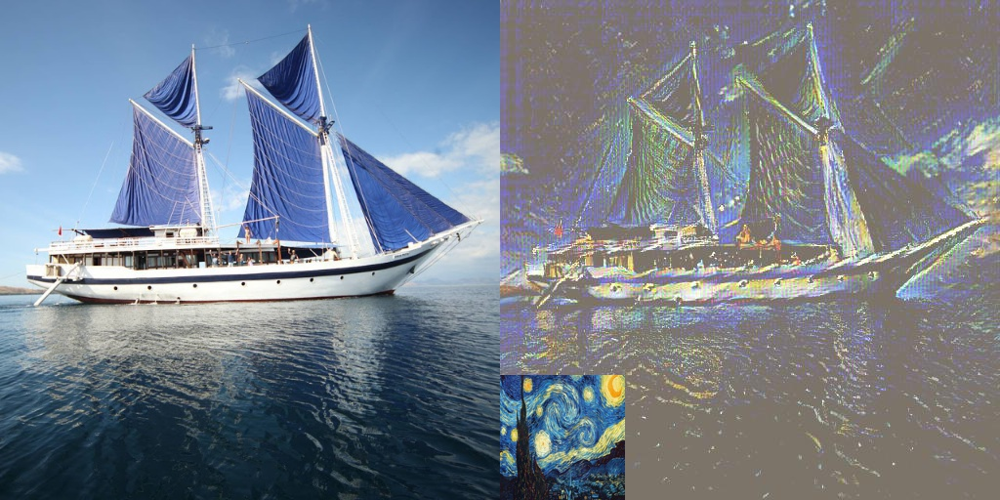

# ✨ Adain ✨
@Author: Zikai Zhou

_Arbitrary Style Transfer in Real-time with Adaptive Instance Normalization(unofficial implementation)_🚀


    
    
    
    
    


## Overview

Using pretraining weights of VGG, adain can do image transfer tasks in real time!

## Technical Features

- **Small Computational Resources**: The size of model weight file is only about 30MB.
- **Real Time Inference**: Inference with model in real time.
- **Multi-style Fusion**: Support multi-style transfer.
- **Color Preserving**: Support preserving the color of original image with transferred image style.

## Getting Started

1. Clone the repository:

   ```bash
   git clone https://github.com/Klayand/Adain.git
   ```

2. Navigate to the project directory:

   ```bash
   cd Adain
   ```

3. Install the dependencies:

   ```
   pip install -r requirements.txt
   ```


## Usage

1. Train model:

   ```
   python train.py --user-envs
   ```
   
2. Inference model:
   ```s
   python test.py --user-envs
   ```

